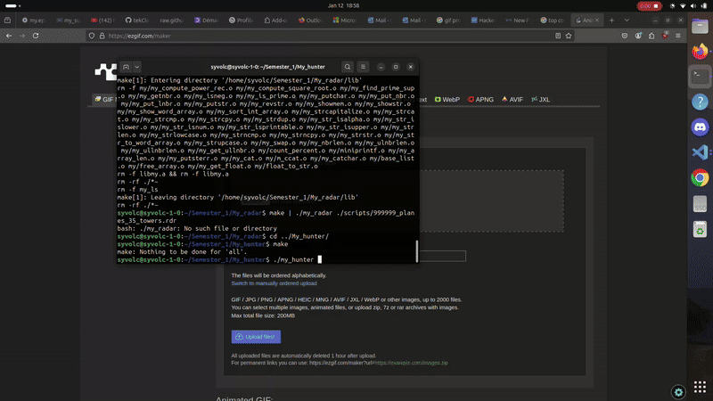

<span style="color:orange; font-size:20em;">
    <h1 align="center">
        <br>
            My Hunter
        <br>
    </h1>
</span>



## Subject:

* My_hunter is a video game of inspired of the duck hunt where: 
    * you can shoot on duck to increase your score.
    * you can shoot in the head of the ducks to double the points you win and to regain life.
    * if you miss your shoot you get a life in less.
    * you need to reload after 3 shoot for that use the key 'R'.

## How To Use

To clone and run this application, you'll need [Git](https://git-scm.com) and [CSFML](https://terminalroot.com/install-csfml-sfml-for-c-language/). Next you can execute these commands to test the project.
```bash
#clone this repository
gitclone git@github.com:tekClovis/My_hunter.git My_hunter

#go in the repository
cd My_hunter

#compil the project
make

#execute the binary to launch the game
./my_hunter

#to get the game rule you can use the "-h" flag like that
./my_hunter -h

```
